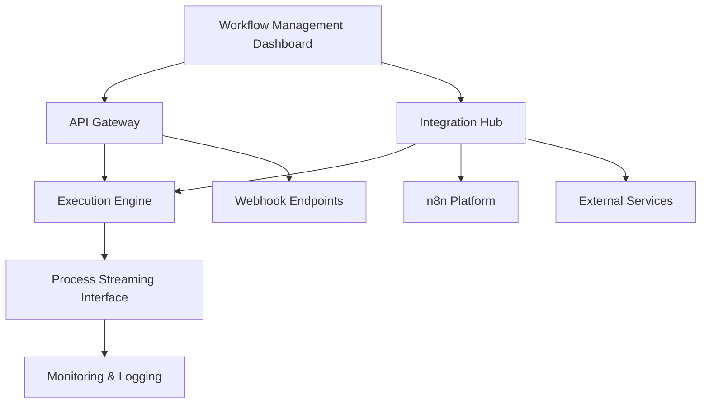

# Workflow Engine and Process Streaming Backend - Product Requirements Document

## 1. Product Overview
A Python-based workflow engine and process streaming backend application designed for seamless integration with n8n and other external services. The system provides real-time workflow orchestration, data processing capabilities, and comprehensive API management for automated business processes.

The platform solves the challenge of complex workflow automation by offering a scalable, extensible backend that can handle both simple task automation and complex multi-step processes with real-time data streaming capabilities.

## 2. Core Features

### 2.1 User Roles
| Role | Registration Method | Core Permissions |
|------|---------------------|------------------|
| System Admin | Direct database setup | Full system access, user management, system configuration |
| Workflow Developer | API key registration | Create, modify, and deploy workflows, access development APIs |
| Service User | Token-based authentication | Execute workflows, view execution status, access assigned workflows |
| Integration Service | Service account setup | API access for external integrations, webhook management |

### 2.2 Feature Module
Our workflow engine consists of the following main components:
1. **Workflow Management Dashboard**: workflow creation, workflow templates, execution monitoring, performance analytics.
2. **API Gateway**: RESTful endpoints, webhook management, authentication, rate limiting.
3. **Process Streaming Interface**: real-time data processing, event streaming, message queuing, data transformation.
4. **Integration Hub**: n8n connector, external service adapters, custom integration builder, webhook receivers.
5. **Execution Engine**: workflow orchestration, task scheduling, error handling, retry mechanisms.
6. **Monitoring & Logging**: execution logs, performance metrics, alert system, audit trails.

### 2.3 Page Details
| Page Name | Module Name | Feature description |
|-----------|-------------|---------------------|
| Workflow Management Dashboard | Workflow Builder | Create and edit workflows using visual interface, define triggers and actions, set conditional logic |
| Workflow Management Dashboard | Template Library | Browse pre-built workflow templates, import/export workflows, version control |
| Workflow Management Dashboard | Execution Monitor | View real-time workflow execution status, track progress, manage running instances |
| API Gateway | Endpoint Management | Configure REST API endpoints, manage authentication tokens, set rate limits |
| API Gateway | Webhook Manager | Register webhook URLs, configure event triggers, manage payload formats |
| Process Streaming Interface | Stream Processor | Handle real-time data streams, apply transformations, route messages |
| Process Streaming Interface | Queue Manager | Manage message queues, configure dead letter queues, monitor queue health |
| Integration Hub | n8n Connector | Sync workflows with n8n, manage n8n webhooks, handle n8n authentication |
| Integration Hub | Service Adapters | Connect to external APIs, manage service credentials, configure data mappings |
| Execution Engine | Orchestrator | Execute workflow steps, manage dependencies, handle parallel execution |
| Execution Engine | Scheduler | Schedule workflow runs, manage cron jobs, handle time-based triggers |
| Monitoring & Logging | Log Viewer | Browse execution logs, filter by workflow/time, export log data |
| Monitoring & Logging | Analytics Dashboard | View performance metrics, generate reports, set up alerts |

## 3. Core Process

**Workflow Developer Flow:**
1. Developer accesses Workflow Management Dashboard
2. Creates new workflow or selects template from Template Library
3. Configures workflow steps, triggers, and actions using Workflow Builder
4. Tests workflow execution through Execution Monitor
5. Deploys workflow to production environment
6. Monitors performance through Analytics Dashboard

**Integration Service Flow:**
1. External service (n8n or other) sends webhook to API Gateway
2. API Gateway authenticates request and routes to appropriate handler
3. Integration Hub processes the request and triggers workflow
4. Execution Engine orchestrates workflow steps
5. Process Streaming Interface handles real-time data processing
6. Results are sent back to requesting service or stored for later retrieval

**System Admin Flow:**
1. Admin accesses system through administrative interface
2. Manages user accounts and permissions
3. Configures system settings and integration parameters
4. Monitors system health through Monitoring & Logging
5. Manages service accounts and API keys

## 4. User Interface Design
### 4.1 Design Style
- **Primary Colors**: Deep blue (#1e3a8a) for headers and primary actions, light blue (#3b82f6) for secondary elements
- **Secondary Colors**: Gray (#6b7280) for text, green (#10b981) for success states, red (#ef4444) for errors
- **Button Style**: Rounded corners (8px radius), subtle shadows, hover animations
- **Font**: Inter or system fonts, 14px base size, 16px for headings
- **Layout Style**: Clean dashboard layout with sidebar navigation, card-based components
- **Icons**: Feather icons or similar minimalist icon set, consistent sizing

### 4.2 Page Design Overview
| Page Name | Module Name | UI Elements |
|-----------|-------------|-------------|
| Workflow Management Dashboard | Workflow Builder | Drag-and-drop interface, node-based editor, property panels, toolbar with common actions |
| Workflow Management Dashboard | Execution Monitor | Real-time status cards, progress bars, log streaming panel, action buttons |
| API Gateway | Endpoint Management | Table view with search/filter, modal forms for editing, status indicators |
| Process Streaming Interface | Stream Processor | Flow diagram visualization, metrics widgets, configuration panels |
| Integration Hub | n8n Connector | Connection status cards, sync buttons, configuration forms |
| Monitoring & Logging | Analytics Dashboard | Charts and graphs, metric cards, time range selectors, export buttons |

### 4.3 Responsiveness
The system is primarily designed for desktop use with responsive design for tablet access. Mobile optimization is considered for monitoring and basic management tasks, with touch-friendly interfaces for critical functions.