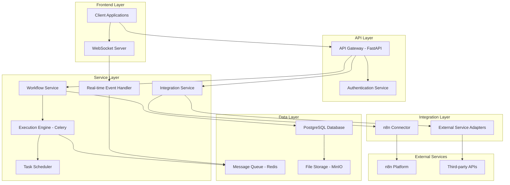
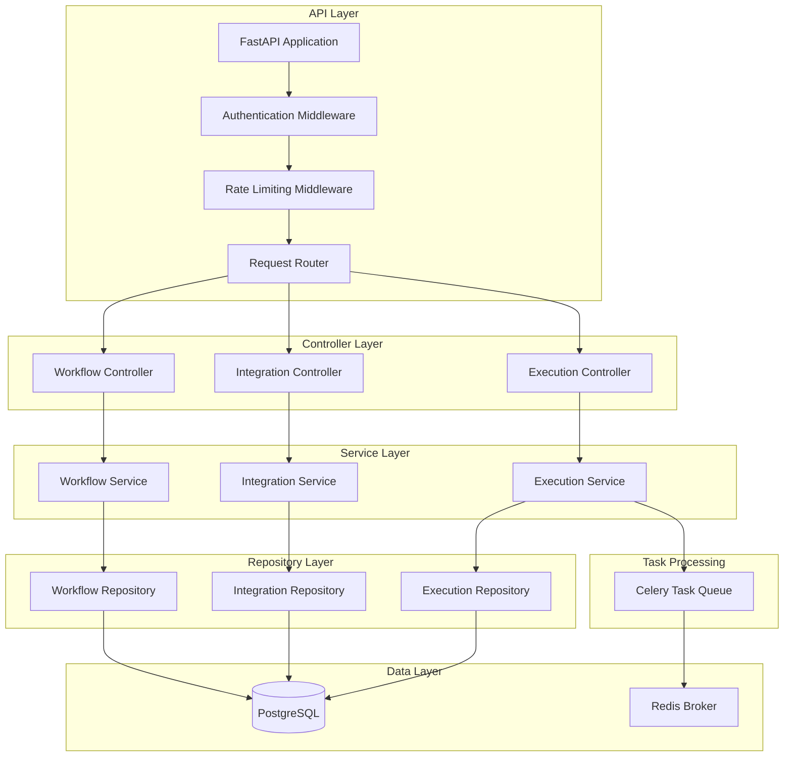
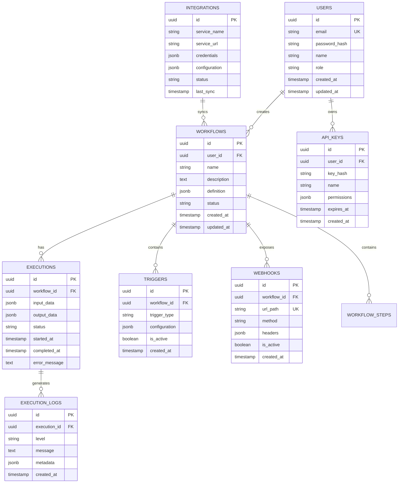

# Workflow Engine and Process Streaming Backend - Technical Architecture Document

## 1. Architecture Design



## 2. Technology Description
- Frontend: React@18 + TypeScript + Tailwind CSS + Vite
- Backend: FastAPI@0.104 + Python@3.11 + Celery@5.3 + Redis@7.2
- Database: PostgreSQL@15 + SQLAlchemy@2.0
- Message Queue: Redis@7.2 + Celery@5.3
- File Storage: MinIO (S3-compatible)
- Authentication: JWT + OAuth2
- Monitoring: Prometheus + Grafana
- Containerization: Docker + Docker Compose

## 3. Route Definitions
| Route | Purpose |
|-------|---------|
| /dashboard | Main dashboard for workflow management and monitoring |
| /workflows | Workflow creation, editing, and management interface |
| /workflows/:id/execute | Workflow execution and real-time monitoring |
| /integrations | Integration hub for n8n and external services |
| /api-keys | API key management and authentication settings |
| /logs | System logs and execution history viewer |
| /analytics | Performance analytics and reporting dashboard |
| /settings | System configuration and user preferences |

## 4. API Definitions

### 4.1 Core API

**Workflow Management**
```
POST /api/v1/workflows
```
Request:
| Param Name | Param Type | isRequired | Description |
|------------|------------|------------|-------------|
| name | string | true | Workflow name |
| description | string | false | Workflow description |
| definition | object | true | Workflow definition in JSON format |
| triggers | array | true | List of trigger configurations |
| variables | object | false | Workflow variables and default values |

Response:
| Param Name | Param Type | Description |
|------------|------------|-------------|
| id | string | Unique workflow identifier |
| status | string | Creation status |
| created_at | datetime | Creation timestamp |

**Workflow Execution**
```
POST /api/v1/workflows/{workflow_id}/execute
```
Request:
| Param Name | Param Type | isRequired | Description |
|------------|------------|------------|-------------|
| input_data | object | false | Input data for workflow execution |
| variables | object | false | Runtime variable overrides |
| async_mode | boolean | false | Whether to execute asynchronously |

Response:
| Param Name | Param Type | Description |
|------------|------------|-------------|
| execution_id | string | Unique execution identifier |
| status | string | Execution status (pending, running, completed, failed) |
| result | object | Execution result (if synchronous) |

**Integration Management**
```
POST /api/v1/integrations/n8n/sync
```
Request:
| Param Name | Param Type | isRequired | Description |
|------------|------------|------------|-------------|
| n8n_url | string | true | n8n instance URL |
| api_key | string | true | n8n API key |
| workflow_ids | array | false | Specific workflows to sync |

Response:
| Param Name | Param Type | Description |
|------------|------------|-------------|
| synced_count | integer | Number of workflows synced |
| errors | array | List of sync errors |

**Webhook Management**
```
POST /api/v1/webhooks
```
Request:
| Param Name | Param Type | isRequired | Description |
|------------|------------|------------|-------------|
| workflow_id | string | true | Target workflow ID |
| event_type | string | true | Webhook event type |
| url_path | string | false | Custom URL path |
| authentication | object | false | Webhook authentication config |

## 5. Server Architecture Diagram



## 6. Data Model

### 6.1 Data Model Definition



### 6.2 Data Definition Language

**Users Table**
```sql
-- Create users table
CREATE TABLE users (
    id UUID PRIMARY KEY DEFAULT gen_random_uuid(),
    email VARCHAR(255) UNIQUE NOT NULL,
    password_hash VARCHAR(255) NOT NULL,
    name VARCHAR(100) NOT NULL,
    role VARCHAR(20) DEFAULT 'developer' CHECK (role IN ('admin', 'developer', 'user')),
    created_at TIMESTAMP WITH TIME ZONE DEFAULT NOW(),
    updated_at TIMESTAMP WITH TIME ZONE DEFAULT NOW()
);

-- Create workflows table
CREATE TABLE workflows (
    id UUID PRIMARY KEY DEFAULT gen_random_uuid(),
    user_id UUID NOT NULL REFERENCES users(id) ON DELETE CASCADE,
    name VARCHAR(255) NOT NULL,
    description TEXT,
    definition JSONB NOT NULL,
    status VARCHAR(20) DEFAULT 'draft' CHECK (status IN ('draft', 'active', 'inactive', 'archived')),
    created_at TIMESTAMP WITH TIME ZONE DEFAULT NOW(),
    updated_at TIMESTAMP WITH TIME ZONE DEFAULT NOW()
);

-- Create executions table
CREATE TABLE executions (
    id UUID PRIMARY KEY DEFAULT gen_random_uuid(),
    workflow_id UUID NOT NULL REFERENCES workflows(id) ON DELETE CASCADE,
    input_data JSONB,
    output_data JSONB,
    status VARCHAR(20) DEFAULT 'pending' CHECK (status IN ('pending', 'running', 'completed', 'failed', 'cancelled')),
    started_at TIMESTAMP WITH TIME ZONE DEFAULT NOW(),
    completed_at TIMESTAMP WITH TIME ZONE,
    error_message TEXT
);

-- Create triggers table
CREATE TABLE triggers (
    id UUID PRIMARY KEY DEFAULT gen_random_uuid(),
    workflow_id UUID NOT NULL REFERENCES workflows(id) ON DELETE CASCADE,
    trigger_type VARCHAR(50) NOT NULL,
    configuration JSONB NOT NULL,
    is_active BOOLEAN DEFAULT true,
    created_at TIMESTAMP WITH TIME ZONE DEFAULT NOW()
);

-- Create webhooks table
CREATE TABLE webhooks (
    id UUID PRIMARY KEY DEFAULT gen_random_uuid(),
    workflow_id UUID NOT NULL REFERENCES workflows(id) ON DELETE CASCADE,
    url_path VARCHAR(255) UNIQUE NOT NULL,
    method VARCHAR(10) DEFAULT 'POST',
    headers JSONB,
    is_active BOOLEAN DEFAULT true,
    created_at TIMESTAMP WITH TIME ZONE DEFAULT NOW()
);

-- Create integrations table
CREATE TABLE integrations (
    id UUID PRIMARY KEY DEFAULT gen_random_uuid(),
    service_name VARCHAR(100) NOT NULL,
    service_url VARCHAR(500),
    credentials JSONB,
    configuration JSONB,
    status VARCHAR(20) DEFAULT 'inactive' CHECK (status IN ('active', 'inactive', 'error')),
    last_sync TIMESTAMP WITH TIME ZONE
);

-- Create api_keys table
CREATE TABLE api_keys (
    id UUID PRIMARY KEY DEFAULT gen_random_uuid(),
    user_id UUID NOT NULL REFERENCES users(id) ON DELETE CASCADE,
    key_hash VARCHAR(255) NOT NULL,
    name VARCHAR(100) NOT NULL,
    permissions JSONB DEFAULT '{}',
    expires_at TIMESTAMP WITH TIME ZONE,
    created_at TIMESTAMP WITH TIME ZONE DEFAULT NOW()
);

-- Create execution_logs table
CREATE TABLE execution_logs (
    id UUID PRIMARY KEY DEFAULT gen_random_uuid(),
    execution_id UUID NOT NULL REFERENCES executions(id) ON DELETE CASCADE,
    level VARCHAR(10) DEFAULT 'info' CHECK (level IN ('debug', 'info', 'warning', 'error')),
    message TEXT NOT NULL,
    metadata JSONB,
    created_at TIMESTAMP WITH TIME ZONE DEFAULT NOW()
);

-- Create indexes
CREATE INDEX idx_workflows_user_id ON workflows(user_id);
CREATE INDEX idx_workflows_status ON workflows(status);
CREATE INDEX idx_executions_workflow_id ON executions(workflow_id);
CREATE INDEX idx_executions_status ON executions(status);
CREATE INDEX idx_executions_started_at ON executions(started_at DESC);
CREATE INDEX idx_triggers_workflow_id ON triggers(workflow_id);
CREATE INDEX idx_webhooks_url_path ON webhooks(url_path);
CREATE INDEX idx_execution_logs_execution_id ON execution_logs(execution_id);
CREATE INDEX idx_execution_logs_created_at ON execution_logs(created_at DESC);

-- Insert initial data
INSERT INTO users (email, password_hash, name, role) VALUES 
('admin@workflow-engine.com', '$2b$12$example_hash', 'System Administrator', 'admin');

INSERT INTO integrations (service_name, service_url, status) VALUES 
('n8n', 'http://localhost:5678', 'inactive');
```